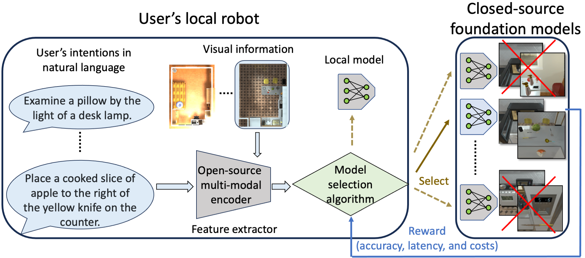
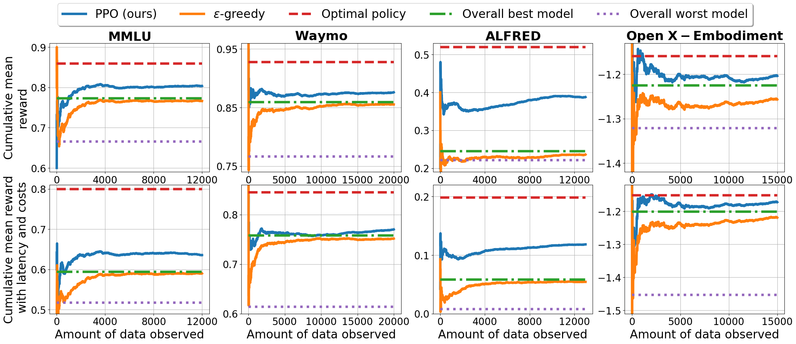

# online_model_query
The is the repo of **Online Foundation Model Selection in Robotics**. 

Link to paper: [Online Foundation Model Selection in Robotics](https://arxiv.org/abs/2402.08570#:~:text=Foundation%20models%20have%20recently%20expanded,paid%2C%20closed%2Dsource%20options.)
Blog post of the paper: [blog link](https://utaustin-swarmlab.github.io/2024/02/17/OnlineModelSelection.html)
## Table of Contents
- [TLDR](#TLDR)
- [Abstract](#abstract)
- [System Pipeline](#system-pipeline)
- [Results](#results)
- [Installation](#installation)
- [Usage](#usage)
- [Citation](#citation)

## TLDR
We expand the ‘model selection problem’ in robotics to include foundation models and present a novel solution that merges an open-source encoder and an online learning algorithm.

## Abstract
<details>
<summary>Click to expand</summary>
Foundation models have recently expanded into robotics after excelling in computer vision and natural language processing. The models are accessible in two ways: open-source or paid, closed-source options. Users with access to both face a problem when deciding between effective yet costly closed-source models and free but less powerful open-source alternatives. We call it the model selection problem. Existing supervised-learning methods are impractical due to the high cost of collecting extensive training data from closed-source models. Hence, we focus on the online learning setting where algorithms learn while collecting data, eliminating the need for large pre-collected datasets. We thus formulate a user-centric online model selection problem and propose a novel solution that combines an open-source encoder to output context and an online learning algorithm that processes this context. The encoder distills vast data distributions into low-dimensional features, i.e., the context, without additional training. The online learning algorithm aims to maximize a composite reward that includes model performance, execution time, and costs based on the context extracted from the data. It results in an improved trade-off between selecting open-source and closed-source models compared to non-contextual methods, as validated by our theoretical analysis. Experiments across language-based robotic tasks such as Waymo Open Dataset, ALFRED, and Open X-Embodiment demonstrate real-world applications of the solution. The results show that the solution significantly improves the task success rate by up to 14%.
</details>

## System Pipeline

**Online model selection pipeline:** A user sends their intentions in natural language and images to a model selected from a range of available options. To do so, an encoder first processes the language and visual inputs to extract features. These features help an online learning algorithm select the suitable model that maximizes accuracy and minimizes response latency and monetary costs. The algorithm should avoid selecting models that execute incorrectly, marked with red crosses. The above examples come from the ALFRED dataset.
</details>

## Results

**Contextual PPO algorithm outperforms baselines in the online model selection problem:**
Our contextual PPO algorithm outperforms non-contextual algorithms, represented as orange, green, and purple lines. Our agent achieves higher cumulative mean rewards with and without latency penalty. This underscores the importance of incorporating context into our model selection pipeline. We also provide the Oracle optimal policy as the ultimate upper bound for all benchmarks.


## Installation
For the installation of the required packages, see the [pyproject.toml](pyproject.toml) file or simply run the following command to install the required packages:
```bash
poetry lock && poetry install
```
The tutorial for the installation of the required packages can be found [install poetry](https://python-poetry.org/docs/#installing-with-the-sofficial-installer).

For the data (mainly the execution results of all models) needed to run the experiments, please download the data from [download link](https://utexas.box.com/s/zxt834xa1oh842nzfsijf6qpllp9fsb9). The data should be placed in the a folder named "synced_data" in the root directory of the repo.

## Usage
The gym environment for the online model selection problem is implemented in the "query/envs/" folder. 
PPO and $\epsilon$-greedy policies which leverages these gym environments for the online model selection agent are implemented in the "query/src/policy/" folder. We also put nont contextual policies modified from [this repo](https://github.com/david-cortes/contextualbandits) in the "query/src/policy/" folder. The plotting and analysis scripts are in the "query/src/plotting/" folder, and the results can be found in the "plot" folder.

## Citation
If you find this repo useful or the paper interesting, please cite our paper:
```
@misc{li2024online,
      title={Online Foundation Model Selection in Robotics}, 
      author={Po-han Li and Oyku Selin Toprak and Aditya Narayanan and Ufuk Topcu and Sandeep Chinchali},
      year={2024},
      eprint={2402.08570},
      archivePrefix={arXiv},
      primaryClass={cs.RO}
}
```
